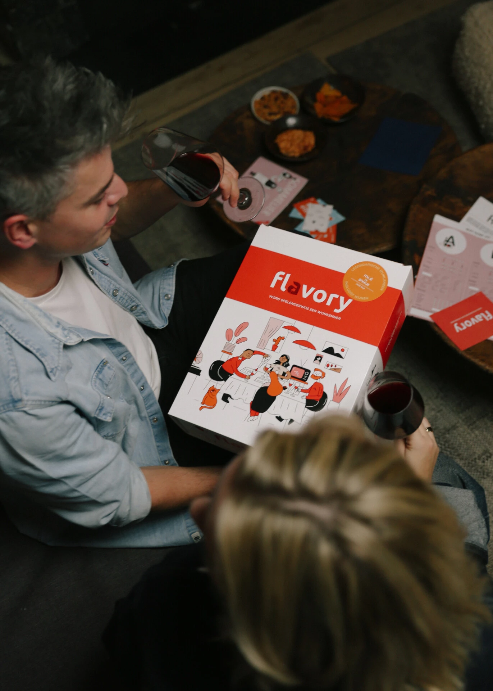
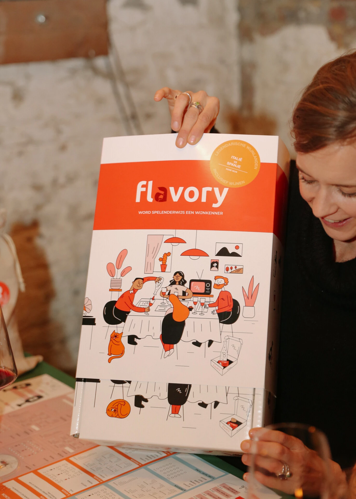
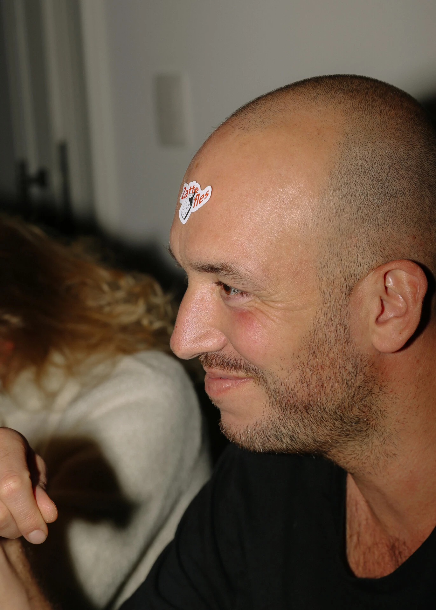

## 1\. Waarom Flavory het beste wijngeschenk voor thuis is

**Niks tegen sokken, boeken of cadeaubonnen maar die heb je vorig jaar ook al gegeven.** Een origineel cadeau straalt uit dat je moeite hebt gedaan.. Je geeft niet enkel wijn, maar ook het vooruitzicht van een gezellige avond cadeau. De box zelf ziet er alvast prachtig uit. Jouw cadeau zal in de smaak vallen, daar hoef je niet aan te twijfelen! En nu maar hopen dat je zelf ook wordt uitgenodigd om mee te spelen

## 2\. Beleving thuis: wijnspel dat je samen speelt

**Wijnproeven, hoe doe je dat eigenlijk?** Welke geuren kan je ruiken? Welke wijn drink je zelf het liefste? Wat is het verschil tussen een glas merlot en een glas cabernet sauvignon? Wedden dat je na het spelen mango kan ruiken in je glas chardonnay?

## 3\. Geen voorkennis vereist – wijn leren proeven thuis

**Dit wijnspel brengt familie en vrienden rond de tafel.** Je hebt enkel nog wijnglazen nodig. De leukste gesprekken komen op gang, iedereen wordt betrokken. Dat je na één avond een echte wijnkenner bent, is overdreven. Maar dat je een superleuke avond gaat beleven die naar meer smaakt, dat is zeker. Je krijgt er trouwens een gratis ‘niet tevreden, geld terug’ – garantie bovenop.

## 4\. Je hoeft niet eens van spelletjes te houden

**Je moet leuke quizvragen beantwoorden** (hoeveel druiven zitten er in een glas wijn?) waardoor je tips kan verzamelen. De grote uitdaging zit hem in het herkennen van de wijnen (ruik jij chocolade?). Het spel begint dadelijk wanneer de doos wordt geopend, geen tijd te verliezen!

## 5\. Waarom mensen zeggen: Flavory is het leukste wijncadeau thuis

**Spelen is leuk, maar winnen is nog veel leuker.** Je hoeft niet de grootste kenner te zijn om uitgeroepen te worden tot wijnkenner van de avond. Met een goed ontwikkeld reukorgaan, frisse smaakpapillen en een beetje geluk kom je al een heel eind. En als je wint, waar ga je jouw diploma dan laten pronken?

  
Benieuwd welk wijngeschenk het beste past bij jouw gelegenheid? Bij Flavory kies je tussen een [rode wijnbox](/shop/rode-wijn/) en een [witte wijnbox](/shop/witte-wijn/), met of zonder wijn. Elke box bevat een uniek wijnspel dat zorgt voor een gezellige én leerrijke avond. Ideaal als cadeau, of om zelf van te genieten.

