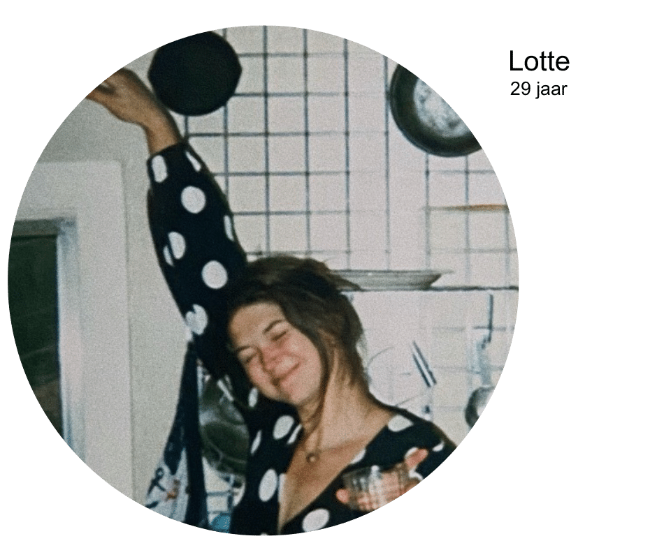

Alcoholvrije wijn wordt steeds populairder. In tegenstelling tot alcoholvrij bier, dat al goed ingeburgerd is, is de wijnwereld wat traditioneler en misschien sceptischer. We laten twee Flavory-fans van het eerste uur aan het woord.

## No Way José!

_"Voor mij kan alcoholvrije wijn, vooral rode wijn, de echte wijnervaring niet vervangen. Het voelt voor mij aan als een soort duur druivensap. Ik waardeer de complexiteit en diepte van traditionele wijnen, en dat mis ik voorlopig nog bij de alcoholvrije varianten."_

## Yes Please!

_"Ik ga bewust om met alcohol en sta zeker open voor alcoholvrije wijn. Ik heb al een uitstekende alcoholvrije schuimwijn geproefd, die was echt lekker! Soms wil ik gewoon geen alcohol drinken omdat ik nog moet rijden of vroeg moet opstaan en dan lijkt alcoholvrije wijn me een heel goed idee."_

## Wat is alcoholvrije wijn?

Alcoholvrije wijn is wijn die na de gisting is gedealcoholiseerd. Er zijn verschillende methodes om alcohol uit wijn te verwijderen. De meest gebruikte methode is vacuümdistillatie. Hierbij wordt de wijn verwarmd onder lage druk, waardoor de alcohol verdampt. De overige bestanddelen van de wijn blijven behouden.

## De voordelen van alcoholvrije wijn

- **Gezondheid:** alcoholvrije wijn bevat minder calorieën dan gewone wijn en is dus een goed alternatief voor mensen die op hun gewicht willen letten. Bovendien is het natuurlijk beter voor je gezondheid om geen of minder alcohol te drinken.
- **Smaak:** alcoholvrije wijn is er in verschillende soorten, van wit tot rood en van mousserend tot stil. Er is dus voor ieder wat wils.
- **Genieten zonder kater:** alcoholvrije wijn is perfect voor wie wil genieten van een glas wijn zonder de nadelige gevolgen van alcohol.

## De nadelen van alcoholvrije wijn

- **Smaak:** niet alle alcoholvrije wijnen zijn even lekker. Sommige hebben een vlakke smaak of smaken zelfs naar zoet appelsap. Dat komt doordat alcohol een belangrijke smaakdrager is in wijn.
- **Prijs:** alcoholvrije wijn is vaak duurder dan gewone wijn, omdat het productieproces complexer is.

## Onze conclusie

Wij van Flavory vinden dat er op het vlak van witte wijn en bubbels al degelijke alcoholvrije varianten bestaan die zeker de moeite waard zijn. Op het vlak van rode wijn is er nog een weg te gaan, maar we zijn ervan overtuigd dat dat snel kan veranderen. Kijk maar hoe snel het in de bierwereld is gegaan de laatste jaren. Wie weet is alcoholvrije rode wijn over een paar jaar net zo lekker als gewone rode wijn!

**Wat vinden jullie?** Zijn jullie al bekend met alcoholvrije wijn? Laat het ons weten in de comments op [Instagram](https://www.instagram.com/p/DGF-OuSM3su/).
