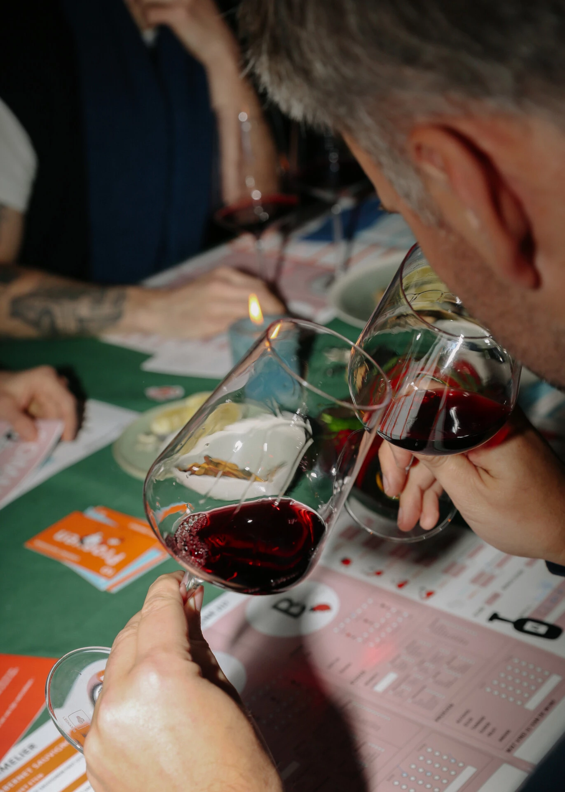

Wist je dat blind wijn proeven zelfs voor wijnexperts één van de moeilijkste dingen is die er bestaat? Ik weet het, want Flavory is er letterlijk uit ontstaan. En ik ga je zo meteen vertellen hoe dat fout is gegaan. Maar eerst dit.

## Waarom je hersenen je voor de gek houden bij blind wijn proeven

In 2001 deed onderzoeker Frédéric Brochet aan de Universiteit van Bordeaux een experiment met 54 studenten oenologie. Dat zijn mensen die wijn studeren. Professioneel. Hij liet ze een rode en een witte wijn proeven en beschrijven. Tot zover niets bijzonders. Maar de truc zat hem hierin: de “rode” wijn was gewoon witte wijn, gekleurd met een geurloze rode kleurstof. En toch beschreven alle studenten die wijn met klassieke rode wijn termen. Rode vruchten, tannines, diepte. Terwijl ze gewoon witte wijn in hun glas hadden.

Het brein ziet rood, en beslist meteen wat het gaat proeven. De neus en tong volgen braaf. Zelfs bij mensen die er jaren voor gestudeerd hebben.

Dat vind ik confronterend. En tegelijk enorm geruststellend. Want als dit al gebeurt bij experts, wat denk je dan dat er met ons gewone stervelingen gebeurt?

## Hoe Flavory ontstond uit één grote blind proef-blunder

Een aantal jaar geleden gingen we zelf blind proeven. Gewoon thuis, een avond, een paar flessen op tafel. Het idee was simpel: ruik, proef, raad. Klinkt leuk. Was het ook. Maar we maakten één fundamentele fout.

We zetten eindeloos veel Bourgognewijnen naast elkaar.

Als je weet dat Bourgogne bijna altijd dezelfde druif gebruikt, Pinot Noir voor rood en Chardonnay voor wit, en dat die druiven groeien in dezelfde streek, op dezelfde bodems, in hetzelfde klimaat, dan begrijp je waarom dat een slecht idee was. Die wijnen lijken altijd op elkaar. We vroegen onszelf te vergelijken wat nauwelijks te onderscheiden is, zelfs niet voor geoefende proevers.

Het resultaat was verwarring, gelach, en af en toe licht geruzie over wie er nu gelijk had. Maar uit die avond groeide wel het idee voor een blind wijnproefspel dat wél werkt. Eentje waarbij de uitdaging haalbaar is en de beleving centraal staat, niet de kennis.

## Kun jij rood van wit onderscheiden? Echt blind?

Jij denkt van wel. Dat denk ik ook altijd. Maar onderzoek toont aan dat zelfs geoefende proevers het er regelmatig naast zitten als kleur, etiket en verpakking verborgen zijn. [Meerdere studies](https://www.wijnkanaal.be/?p=wijnarchief_detail&id=210) bevestigen dat mensen die beweren dure wijn van goedkope te kunnen onderscheiden, dat blind in slechts de helft van de gevallen goed doen. Dat is een gok. Een muntje opgooien geeft je dezelfde kans.

Ik doe zelf regelmatig wijnproefavonden, waarbij mensen de prijs van de wijn proberen te raden. En ik weet hoe verleidelijk het is om te denken: die is krachtig, die is complex, dus die is duur. Dat klopt soms. Maar lang niet altijd.

Wat je eigenlijk het eerst wilt weten, is of een wijn in balans is. Als er iets overheerst, te veel zuur, te veel alcohol, te veel tannines, dan weet je bijna zeker dat het geen topwijn is. Want dat is de kerntaak van elke wijnmaker: een wijn maken die in balans is. Als dat lukt, pas dan kan je beginnen nadenken over prijs.

Daarna kijk je naar de afdronk. Hoe lang blijft de smaak hangen? Een wijn die meteen wegvalt, is zelden duur. Een wijn die uitnodigt om nog een slok te nemen, waarbij de smaak evolueert in je mond, dat is een ander verhaal.

Maar zelfs dan kun je je lelijk vergissen. Oost-Europese wijnen zijn daar het beste voorbeeld van. Een Georgische Saperavi of een Moldavische Rara Neagra kan je compleet verrassen met zijn kracht en complexiteit, terwijl je misschien verwacht dat het een goedkope fles is. En een Italiaanse Negroamaro of Primitivo uit Zuid-Italië? Die kan zo fruitig en vol zijn dat je zwéért dat het een dure wijn is. Terwijl hij gewoon betaalbaar is.

## Wat maakt blind wijn proeven dan zo leuk?

Precies dat. De verrassingen. Het moment waarop iedereen aan tafel denkt dat ze het weten, en het dan toch mis hebben. De lach die volgt. De discussie over wat je wel en niet proefde. Het besef dat jouw neus soms slimmer is dan je brein, en soms ook niet.

Blind proeven haalt alle snobisme weg. Er is geen goed antwoord, geen verkeerd antwoord. Er is alleen wat jij proeft. En dat is meer waard dan elk wijnboek bij elkaar.

Denk je dat jij rood van wit kunt onderscheiden? Dat je de dure van de goedkope fles herkent? Bewijs het. Pak een paar flessen, maak de etiketten onzichtbaar, en zie hoe goed jij het er werkelijk van afbrengt. Of doe het gestructureerd met het [Flavory wijnproefspel](/), waarbij de uitdaging al voor je klaarstaat en je enige taak is om te proeven, te lachen, en je vrienden voor schut te zetten.

