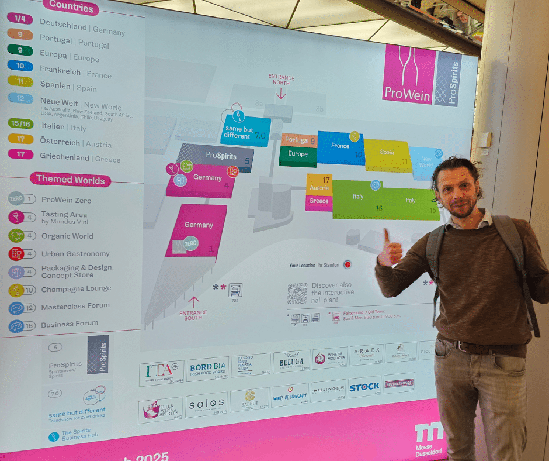
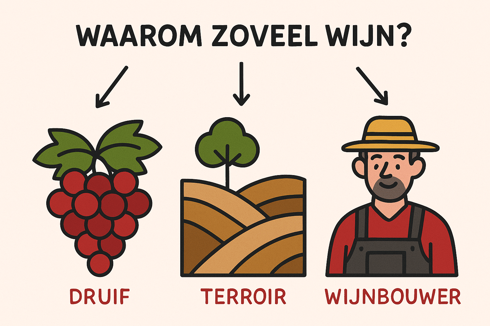

We moesten er vorige week zijn (beroepshalve natuurlijk 😉) op de _wijnbeurs in Düsseldorf._ Niet zomaar een beurs, maar _de_ grootste wijnbeurs ter wereld. En eerlijk gezegd, we zijn daar half flabbergasted en een beetje licht in het hoofd weer buiten gewandeld.

We wisten dat er veel wijn bestaat, maar dit… dit was een tsunami van flessen, etiketten, smaken en geuren. Als we dat allemaal zouden willen proeven, moeten we minstens duizend jaar worden. En dan stel je je onvermijdelijk de vraag: **waarom is er eigenlijk zoveel wijn?** Hoe kan het dat er zóveel verschil zit tussen al die flessen, zelfs als ze uit hetzelfde land of van dezelfde druif komen?

Elke wijn is uniek. En dat is geen toeval. Er zijn drie belangrijke redenen waarom geen twee flessen ooit identiek zijn: **de druif, het terroir en de keuzes van de wijnmaker**.

Geen enkele druif groeit exact op dezelfde plek, met exact dezelfde zon, wind of regen. En geen enkele wijnbouwer werkt elk jaar op exact dezelfde manier. Zelfs al doet hij z’n uiterste best om precies dezelfde wijn te maken als het jaar ervoor, het resultaat zal altijd nét dat tikkeltje anders zijn. Wijn laat zich nu eenmaal niet volledig controleren — en dat is net wat het zo boeiend maakt.

## 1\. De druif: de basis van alles 🍇

Net zoals appels in soorten komen (Granny Smith, Jonagold, Golden Delicious…), bestaan er ook tal van verschillende druivenrassen. Sommige zijn wereldberoemd, andere eerder lokaal of vergeten pareltjes.

De bekendste witte druiven zijn:

-   **Chardonnay** – boterig, vol en vaak houtgelagerd
-   **Sauvignon Blanc** – fris, grassig, met een zuurtje
-   **Riesling** – licht, mineraal, soms met een zoetje

En bij de rode toppers vinden we o.a.:

-   **Merlot** – zacht en fruitig
-   **Cabernet Sauvignon** – krachtig, met stevige tannines
-   **Pinot Noir** – licht, elegant en complex

Elke druif heeft zijn eigen karakter, smaakprofiel én voorkeur voor bepaalde klimaten. Dat maakt al een gigantisch verschil in wat er uiteindelijk in je glas belandt.

## 2\. Terroir: de ziel van de wijn 🌍

“Terroir” is zo’n typisch Frans woord dat moeilijk te vertalen valt. Het omvat **alles wat met de omgeving te maken heeft**: de bodem, het klimaat, de ligging van de wijngaard, de hoogte, hoeveel zon er is, hoeveel regen valt…

Denk maar aan aardbeien uit volle grond versus aardbeien uit een serre: ze zien er hetzelfde uit, maar smaken heel anders. Zo werkt het ook met wijn. Een Chardonnay uit de Bourgogne smaakt anders dan eentje uit Zuid-Afrika, zelfs als het van dezelfde druif komt.

Terroir zorgt ervoor dat wijn een gevoel van _plaats_ krijgt. Dat maakt het net zo boeiend.

## 3\. De wijnbouwer: de artiest achter de fles 🎨

Tot slot is er nog **de hand van de maker**. Want zelfs met dezelfde druiven en hetzelfde terroir, kunnen twee wijnmakers een totaal verschillende fles produceren.

Ze maken keuzes zoals:

-   Wanneer oogsten we de druiven?
-   Gaan we de wijn op hout laten rijpen of niet?
-   Gebruiken we wilde gisten of gekweekte gisten?
-   Hoe lang laten we hem rusten?

Sommige wijnmakers grijpen zo weinig mogelijk in, anderen sturen net heel bewust het proces. Elke beslissing beïnvloedt het eindresultaat.

Het is dus een beetje zoals met koken: geef drie chefs dezelfde ingrediënten, en je krijgt drie verschillende gerechten

## Conclusie: wijn is nooit gewoon maar wijn…

Achter elk glas schuilt een verhaal van natuur, vakmanschap en keuzes. En dat maakt proeven zo boeiend: je ontdekt telkens iets nieuws.

Dus de volgende keer dat je een glas inschenkt, neem even de tijd. Kijk. Ruik. Proef. En denk: **wat maakt déze wijn uniek?**

Santé! 🥂
