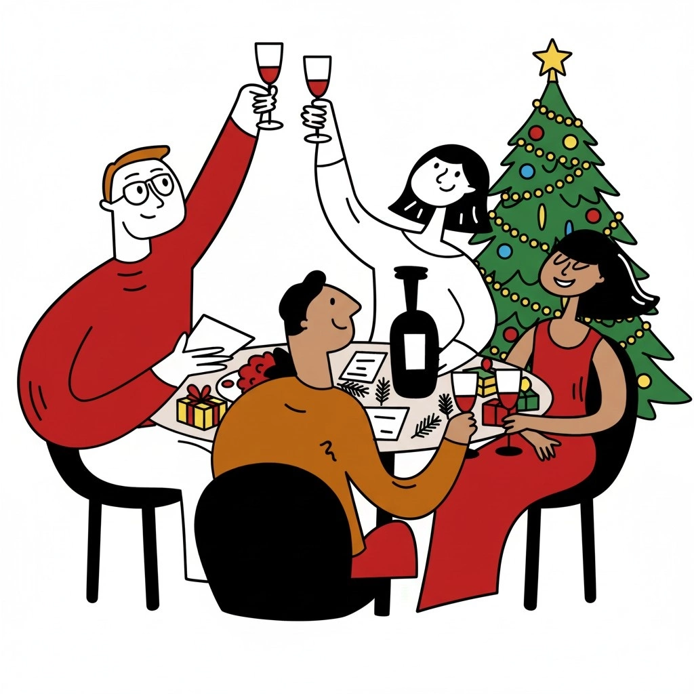

Rond 15 december krijgen we traditioneel de eerste mailtjes.  
Linda vraagt of we kunnen garanderen dat haar luxe wijnpakket als geschenk op tijd geleverd wordt, zodat ze op kerstavond nonkel Herman kan verrassen. Dat lukt!

Het mailtje van Laurien op 23 december is van een andere orde.  
“Jullie spelbox lijkt me perfect als populair cadeau voor een wijnliefhebber als mijn vriend. Kan ik er nog eentje bestellen voor kerst?”

Dat is het moment waarop we in alle eerlijkheid moeten toegeven dat zelfs de beste postbode geen magie kan doen. De week voor kerst is een logistieke jungle: volle depots, vertraagde wagens, wachttijden waar niemand vrolijk van wordt. **En ik heb zelf geen zin om op 24 december naar [Bachten de Kupe](https://nl.wikipedia.org/wiki/Bachten_de_Kupe) te rijden, hoe mooi het daar naar het schijnt ook is.**

## Luxe wijnpakket als geschenk (part1)

Bijna zeven op de tien mensen zegt stress te voelen bij het zoeken naar kerstcadeaus. En dat is precies het tegenovergestelde van wat kerst zou moeten betekenen: samen genieten zonder druk. Iedereen heeft wel een verhaal zoals dit: je trekt bij Secret Santa je neef die om de laatste biografie van Cristiano Ronaldo vraagt; jij gaat naar de winkel, laat het boek inpakken, legt het onder de boom en hij doet beleefd alsof het een verrassing is. We kunnen beter. Door cadeaustress te vermijden en originele belevingen te kiezen in plaats van voorspelbare cadeaus, wordt de kerstperiode weer iets om naar uit te kijken. Dat is iets waar we bij [Flavory](/) echt ons best voor doen.

Secret Santa klinkt leuk, maar het leidt vaak tot lijstjes vol bonnen, sokken en andere clichés. Je koopt iets omdat het moet, niet omdat je iemand echt wilt verrassen. Bovendien is december logistiek een nachtmerrie: drukke winkels, files en bezorgdiensten die op hun limiet draaien. Wie nu bestelt, heeft rust en korting. Wie wacht tot half december, belandt in het last‑minute drama.

## Vijf redenen om dit jaar een wijnspel te geven, een opsomming:

**Een ervaring, geen object.** In plaats van een anonieme fles of doos pralines geef je een avond vol plezier. Blind proeven helpt je om geuren te herkennen en je smaak te ontdekken

**Gezelligheid rond de tafel.** Het spel brengt familie en vrienden samen; je hebt enkel glazen nodig en de gesprekken komen vanzelf

**Luchtig en toegankelijk.** De quizvragen zijn speels je hoeft geen wijnkenner te zijn om mee te doen.

**Een cadeau voor mensen die alles hebben.** Het wijnspel is geen klassieke wijnkist; het is een blind proeverij met twee wijnen en een spel Ideaal voor de persoon die zegt niks nodig te hebben.

**Rust dankzij vroeg bestellen.** Wie begin december bestelt, profiteert van de hoogste korting en volledige keuze. Wacht niet tot de populaire box ([Italië – Spanje](/shop/italie-of-spanje/) bijvoorbeeld) uitverkocht is. Want dat is pas een luxe wijnpakket als geschenk.

## Antwoorden op vaak gestelde Flavory vragen

Mensen googelen van alles: Waar vind ik de beste wijncadeaus online? Welke wijnaccessoires zijn populair als cadeau? Waar kan ik een luxe wijnpakket bestellen? Al die vragen leiden naar hetzelfde: je zoekt een origineel cadeau dat snel geleverd wordt, liefst in België, en dat meer doet dan gewoon in een kast belanden.

Stress vermijden begint met vooruitdenken. Door nu je kerstcadeau te kiezen, vermijd je het logistieke moeras en geniet je van de hoogste korting. Flavory verzendt gratis vanaf twee boxen, zodat je samen met iemand anders kunt bestellen en meteen meerdere cadeaus hebt.

## Luxe wijnpakket als geschenk (part2)

Bijna zeven op de tien mensen voelt de druk van cadeaustress. Dit jaar kun je daar verandering in brengen. Laat de voorspelbare cadeaus en Secret Santa links liggen en kies voor een beleving die bijblijft. Een blind wijnspel is een geschenk voor iedereen aan tafel, inclusief jijzelf. Zo wordt kerst weer wat het hoort te zijn: samen ontspannen, leren en genieten.

