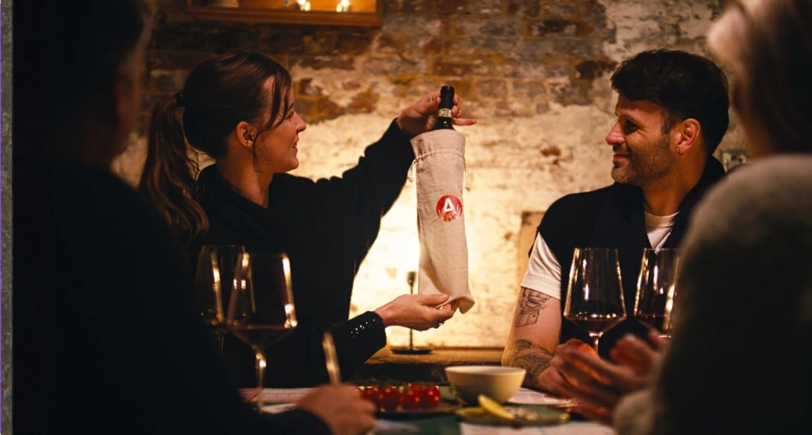

Wil je een **originele date night thuis** organiseren en zoek je de perfecte wijn? In deze blog ontdek je de beste wijnen voor een romantische avond én geven we je een tip om samen de liefde te vieren.

## Een sprankelend begin met Bubbels

Bubbels zijn de ultieme drank van de liefde en perfect om een romantische avond mee af te trappen. Ze prikkelen de zintuigen, stimuleren de stemming en brengen direct een feestelijk gevoel met zich mee.

-   **Champagne:** Geen drankje is zo romantisch en verleidelijk als Champagne. Kies voor een loepzuivere Brut als jullie van een droge, verfrissende smaak houden.
-   **Cava & Prosecco:** Zoek je een vrolijk en toegankelijk alternatief? Een Spaanse Cava (met een fruitigere smaak) of een aromatische Italiaanse Prosecco is minstens zo feestelijk en perfect om samen mee te proosten

## Passie in een glas: Rode Wijn

Rode wijn is een klassieke en sensuele keuze voor een romantische ontmoeting. Het nodigt uit tot een goed gesprek bij kaarslicht. Welke stijl past bij jullie?

-   **Rode [Bourgogne](https://nl.wikipedia.org/wiki/Bourgondi%C3%AB_(regio)) (Pinot Noir):** Deze wijn is een absolute favoriet vanwege zijn elegante en verfijnde karakter. Het zijdeachtige mondgevoel maakt het een uitstekende keuze voor een intieme avond.
-   **[Barolo](https://nl.wikipedia.org/wiki/Barolo_(wijn)):** Gemaakt van de Nebbiolo-druif in het Italiaanse Piëmonte. Barolo heeft karakter, een robuuste structuur en intense aroma’s van rijp rood fruit en kruiden. Perfect voor liefhebbers van wijnen met veel diepgang.
-   **[Amarone della Valpolicella](https://nl.wikipedia.org/wiki/Amarone_della_Valpolicella):** Zoek je een zwoele, warme en krachtige wijn? Dan is de Italiaanse koningswijn Amarone een onweerstaanbare en verleidelijke optie.

## Fris en elegant: Witte Wijn & Rosé

Niet iedereen houdt van zware rode wijnen. Een goed gekozen witte wijn of rosé kan net zo romantisch zijn.

-   **Witte wijn:** Witte wijn staat symbool voor elegantie en zuiverheid. Een loepzuivere Chablis (Chardonnay) of een aromatische Sauvignon Blanc is fris, fruitig en past perfect bij lichte gerechten zoals vis of salades.
-   **Rosé:** De zachte, roze kleur van rosé doet direct denken aan liefde en passie. Een droge, lichte Provence-rosé staat bekend om zijn verfijnde aroma’s van rood fruit en bloemen en is een uiterst elegante keuze.

## Sluit de avond zoet af

Een romantische avond afsluiten met een dessertwijn is een cadeau op zich. Een weelderige, zoete Sauternes uit Bordeaux is fantastisch bij een dessert. Liever iets lichters? Een Moscato d’Asti biedt een dromerige, lichte zoetheid met zachte bubbels.

——————————————————————————–

## De ultieme Date Night tip: Speel een Wijnproeverij Spel!

Wil je jouw date night echt uniek maken en originele activiteiten voor koppels in huis halen?. In plaats van gedachteloos een fles open te trekken, kun je er een speelse en interactieve avond van maken.

Met het [**Flavory wijnproeverij spel**](/shop/) organiseer je eenvoudig een blinde wijnproeverij bij je thuis. Glazen klaar, fles open, en ontdekken maar!. Laat twee beroemde wijnlanden of druivensoorten tegen elkaar strijden en kom er geblinddoekt achter wat jullie nu eigenlijk écht lekker vinden. Ligt jullie smaak op één lijn, of mijlenver uit elkaar?.

Vergeet niet dat de beste wijn voor een romantische avond de wijn is die je deelt met je geliefde. Zorg voor mooie glazen, zet een zacht muziekje op, steek de kaarsen aan en geniet van elkaars gezelschap. Proost op de liefde!.

