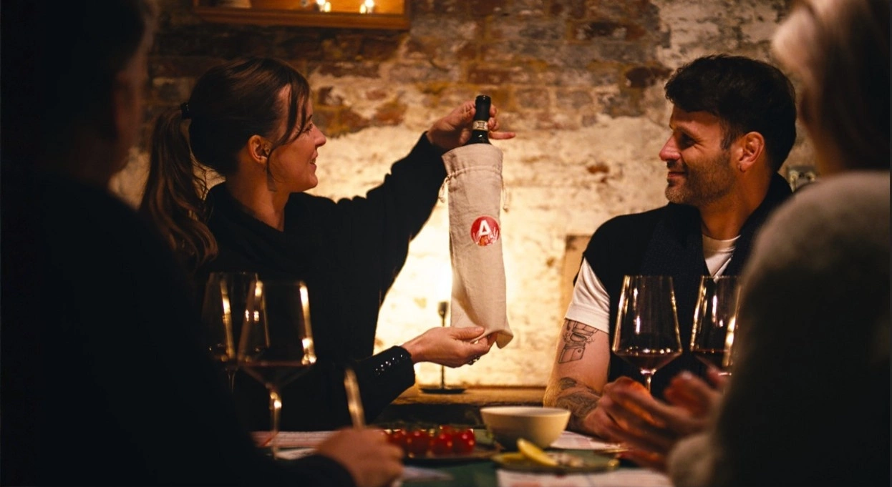

Hoe? Met een origineel wijnproeverij spel bijvoorbeeld. Geen saaie lezing, maar een interactieve quiz om uit te zoeken wie de grootste wijnkenner van jullie vriendengroep is. Je hebt helemaal geen voorkennis nodig.

Het mooiste van dit concept? Jullie hebben de regie helemaal zelf in handen. Wij leveren het spel, jullie scoren de wijn, als je dat zelf wil natuurlijk. Hier is jullie missie voor het komende vriendenweekend.

## Stap 1: De basis voor je vriendenweekend – Het Wijnproeverij Spel

Wij verkopen boxen met wijn en boxen zónder wijn. Waarom ook zonder wijn? Omdat jij zelf je budget en kwaliteit moet kunnen bepalen. En omdat sommige vriendengroepen genoeg hebben aan een enkel glaasje per persoon (wat in theorie voldoende is om wijn te leren proeven), terwijl andere graag wat meer wijn willen kunnen drinken.

In één box zitten alle formulieren en materialen voor een complete wijnproefavond voor 2 tot 6 personen. Zijn jullie met een grotere groep? Dan bestel je gewoon twee dozen.

-   **Prijs voor de [boxen mét wijn](/shop/):** €49,90 per box
-   **Prijs voor de [boxen zónder wijn](/shop/):** €24,90 per box

In dit spel leer je stap voor stap hoe je wijn moet proeven. Het is opgebouwd als een quiz, waardoor de competitie al snel losbarst.

## Stap 2: Scoor zelf de wijn voor je vriendenweekend

Zodra je de box in huis hebt, begint het echte werk: je moet zelf de wijn gaan kopen.

Stel dat jullie gekozen hebben voor rode wijn. Dan is jullie missie als volgt: Je gaat op zoek naar één fles Merlot en één fles Cabernet Sauvignon. Welke wijn je moet kopen, wordt duidelijk omschreven in de speldoos zelf. Maar we geven je hier alvast wat info.

**De Gouden Regel bij het kopen:** Je moet flessen zoeken die monocépage zijn. Dit betekent dat de wijn voor 100% uit die ene druif moet bestaan.

**Waar koop je deze wijnen?** Je kunt het jezelf heel makkelijk maken door gewoon naar de supermarkt te gaan. Zowel Delhaize als Colruyt hebben uitstekende opties voor deze klassieke druiven. We hebben alvast wat suggesties voor je klaargezet:

-   **Bij [Albert Heijn](https://www.ah.be/) of [Gall & Gall:](https://www.gall.nl/)** Zoek naar het bekende wijnhuis _Lindeman’s_ (pak de Bin 40 Merlot en de Bin 45 Cabernet Sauvignon) of ga voor de _Casillero del Diablo_ flessen.
-   **Bij [Delhaize](https://www.delhaize.be/?gclsrc=aw.ds&&cmpid=SEA_Ecom_PureBrand-AO_20250026_NL_search_ROAS_88745249678_602908627330_NA_Google_KW_AO&utm_medium=Sea&utm_source=Google&utm_campaign=Sea&utm_term=Search&utm_content=ROAS&gad_source=1&gad_campaignid=8708300822&gclid=CjwKCAiAkvDMBhBMEiwAnUA9BYWk7F0EDm9-czuEyZ_dsfEKL9LYYoyj6H79SKQ3B_7vL5DkpOu4NhoCxkYQAvD_BwE):** Zoek naar het merk _Santa Tierra_ en zet zowel hun Merlot als hun Cabernet Sauvignon in je winkelkar.
-   **Bij [Colruyt](https://www.colruyt.be/nl/producten/alle-categorieen/wijn?page=1):** Vraag de winkelmedewerker simpelweg naar twee mono-cépage wijnen uit dezelfde reeks huiswijnen.

Ga je liever naar de lokale wijnhandelaar? Perfect! Vraag hem dan specifiek om een “redelijk typische Merlot” en een “redelijk typische Cabernet Sauvignon”. Zeg er duidelijk bij dat je géén “speciale” wijnen wilt. Je bent op zoek naar wijnen die exact smaken naar wat die druif hoort te zijn, zodat je ze goed met elkaar kunt vergelijken.

_Praktische tip: Uit één fles haal je ongeveer 6 tot 7 grote glazen wijn. Houd daar rekening mee bij het inslaan! Wil je meer drinken, koop dan gewoon wat extra flessen van dezelfde soort._

## Stap 3: Spelen maar!

Jullie hebben de flessen, jullie hebben de box. Laat het vriendenweekend maar beginnen. Ontdek de smaken, daag elkaar uit en kroon de ultieme wijnkenner van de groep!

